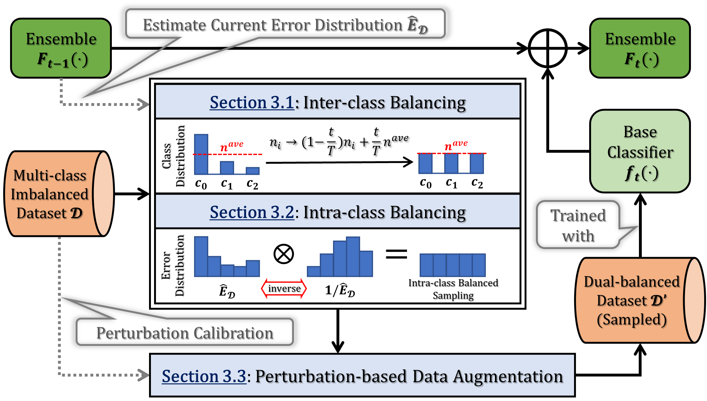
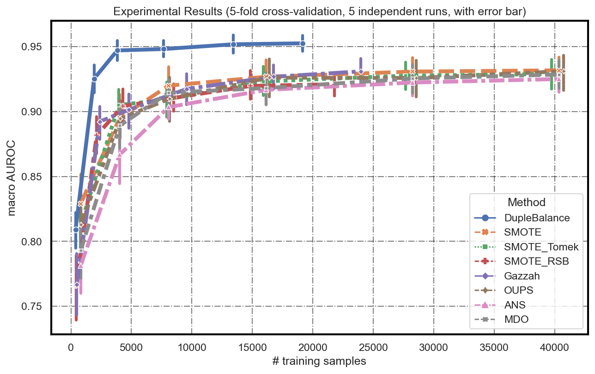
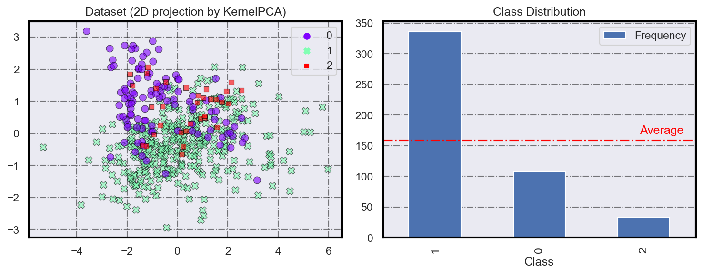
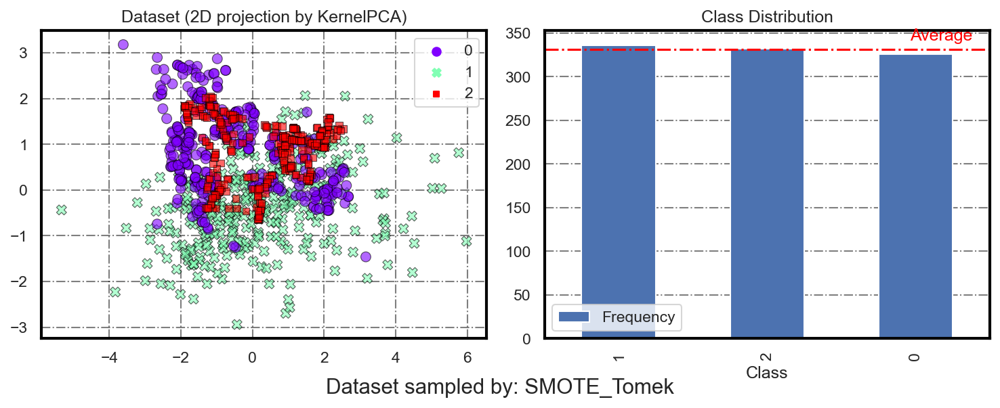
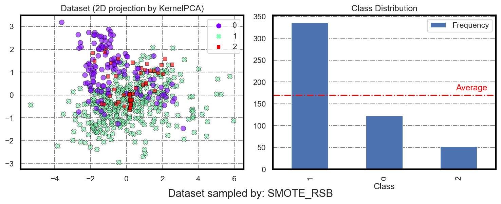
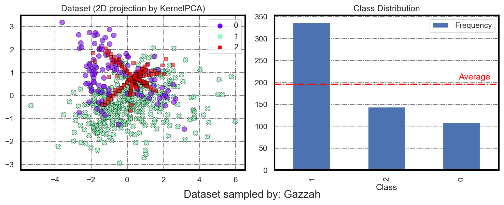
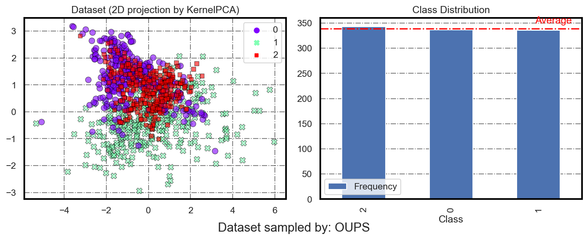
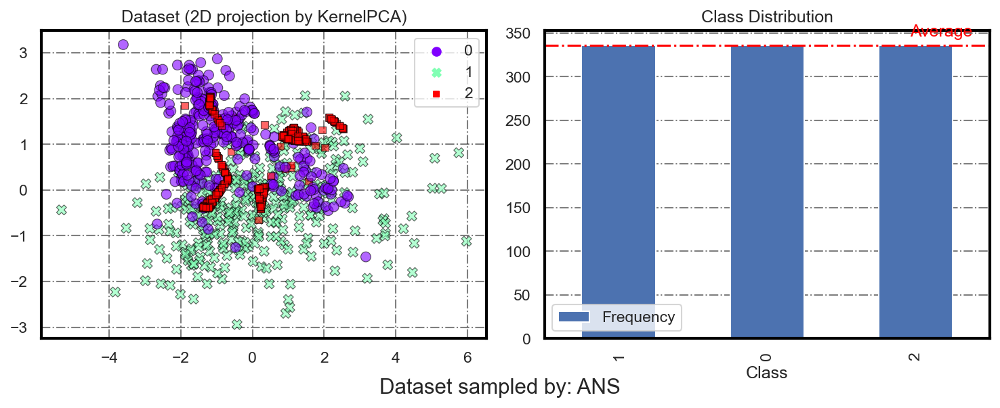
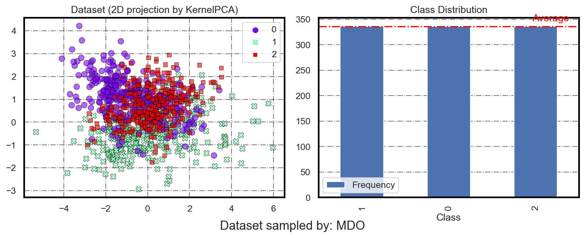

<h1 align="center"> DupleBalance </h1>

<p align="center">
  
  =3.8.0-blue">
  
  
</p>

<h4 align="center"> "DupleBalance: Robust Imbalanced Multi-class Classification via
Inter-class and Intra-class Balancing" <br> (Submited to ACM SIGKDD 2021) </h4> 

**DupleBalance is an *ensemble learning framework* for imbalanced multi-class classification. It is an easy-to-use solution to multi-class imbalanced learning problems, features good performance, computing efficiency, and wide compatibility with different learning models.**

# Table of Contents

- [Table of Contents](#table-of-contents)
- [Background](#background)
- [Install](#install)
- [Usage](#usage)
  - [Documentation](#documentation)
- [Examples](#examples)
  - [Running duplebalance.py](#running-duplebalancepy)
  - [Running duplebalance-example.ipynb](#running-duplebalance-exampleipynb)
- [Miscellaneous](#miscellaneous)
- [References](#references)

# Background

Learning a classifier from skewed datasets, i.e., class-imbalanced learning, is an important and common problem in data mining. Unfortunately, existing methods often suffer from an unsatisfactory performance, high computational cost, or lack of adaptability. They ignored that there are two kinds of imbalance that both need to be considered: *the difference in quantity between examples from different classes as well as between easy and hard examples within a single class*. To this end, we present **DupleBalance**, a novel *ensemble + dynamic sampling approach* that takes both inter-class and intra-class imbalance into account. Specifically, **DupleBalance** achieves inter-class balancing via *progressively-balanced hybrid sampling* (i.e., undersample the majority and oversample the minority classes), and intra-class balancing by *computing and harmonizing the prediction error distribution*. We stress that DupleBalance is quite efficient because it is free from computationally expensive operations, including distance computing and training dataset expansion, which are widely used by most of existing resampling methods. The figure below gives an overview of the **DupleBalance** framework.



# Install

Our DupleBalance implementation requires following dependencies:
- [python](https://www.python.org/) (>=3.8.5)
- [numpy](https://numpy.org/) (>=1.19.2)
- [pandas](https://numpy.org/) (>=1.1.3)
- [scikit-learn](https://scikit-learn.org/stable/) (>=0.23.2)

You can install DupleBalance by clone this repository:

```Shell
git clone https://github.com/KDD2021AnonymousSubmission/dualbalance.git
```

To install requirements, simply run:

```Shell
pip install -r requirements.txt
```

# Usage

A minimal example:

```python
# load dataset & prepare environment
from duplebalance import DupleBalanceClassifier
from sklearn.tree import DecisionTreeClassifier
from sklearn.datasets import make_classification
from utils import make_long_tail

X, y = make_classification(n_samples=1000, n_features=4,  
                           n_classes=3, class_sep=0.8,
                           n_informative=3, n_redundant=1,
                           random_state=0, shuffle=False)
X, y = make_long_tail(X, y, imb_type='log', log_n=2, imb_ratio=10, random_state=42)

# ensemble training
clf = DupleBalanceClassifier(
    base_estimator=DecisionTreeClassifier(), 
    n_estimators=10)
clf.fit(X_train, y_train)

# predict
y_pred_test = clf.predict_proba(X_test)
```

## Documentation

**Our DupleBalance implementation can be used much in the same way as the ensemble classifiers in [sklearn.ensemble](https://scikit-learn.org/stable/modules/classes.html#module-sklearn.ensemble).** The `DupleBalanceClassifier` class inherits from the `sklearn.ensemble.BaseEnsemble` base class. Main parameters are listed below:

| Parameters    | Description   |
| ------------- | ------------- |
| `base_estimator` | *object, optional (default=`sklearn.tree.DecisionTreeClassifier()`)* <br> The base estimator to fit on self-paced under-sampled subsets of the dataset. NO need to support sample weighting. Built-in `fit()`, `predict()`, `predict_proba()` methods are required. |
| `n_estimators`    | *int, optional (default=10)* <br> TThe number of base estimators in the ensemble. |
| `n_bins`         | *int, optional (default=5)* <br> The number of bins in the histogram (for approximation of the error distribution). |
| `alpha`         | *float, optional (default=0)* <br> The perturbation coefficient (for adjustment of the intensity of data augmentation). |
| `estimator_params`         | *list of str, optional (default=tuple())* <br> The list of attributes to use as parameters when instantiating a new base estimator. If none are given, default parameters are used. |
| `n_jobs`         | *int, optional (default=None)* <br> The number of jobs to run in parallel for :meth:`predict`. ``None`` means 1 unless in a :obj:`joblib.parallel_backend` context. ``-1`` means using all processors. See :term:`Glossary <n_jobs>` for more details. |
| `random_state`   | *int / RandomState instance / None, optional (default=None)* <br> If integer, random_state is the seed used by the random number generator; If RandomState instance, random_state is the random number generator; If None, the random number generator is the RandomState instance used by `numpy.random`. |
| `verbose`         | *int, optional (default=0)* <br> Controls the verbosity when fitting and predicting. |

# Examples

## Running [duplebalance.py](https://github.com/KDD2021AnonymousSubmission/dualbalance/blob/main/duplebalance.py)

We implement a minimal working example in [duplebalance.py](https://github.com/KDD2021AnonymousSubmission/dualbalance/blob/main/duplebalance.py), you can test it by running:

```powershell
python duplebalance.py --n_estimators=10 --verbose=1
```

Outputs should be like:

```
A minimal working example:
----------------------------------------------------
# Samples     : 237
# Features    : [0 1 2 3]
# Classes     : 3
Classes       : 0/1/2
Class Dist    : 167/54/16
McIR          : 10.44/3.38/1.00
----------------------------------------------------
Iteration 1   : training set class distribution {0: 158, 1: 56, 2: 22}
Iteration 2   : training set class distribution {0: 149, 1: 59, 2: 29}
Iteration 3   : training set class distribution {0: 141, 1: 62, 2: 35}
Iteration 4   : training set class distribution {0: 132, 1: 64, 2: 41}
Iteration 5   : training set class distribution {0: 123, 1: 66, 2: 48}
Iteration 6   : training set class distribution {0: 114, 1: 69, 2: 54}
Iteration 7   : training set class distribution {0: 105, 1: 72, 2: 60}
Iteration 8   : training set class distribution {0: 97, 1: 74, 2: 66}
Iteration 9   : training set class distribution {0: 88, 1: 76, 2: 73}
Iteration 10  : training set class distribution {0: 79, 1: 79, 2: 79}
[Parallel(n_jobs=1)]: Using backend SequentialBackend with 1 concurrent workers.
[Parallel(n_jobs=1)]: Done   1 out of   1 | elapsed:    0.0s finished

Macro AUROC score: 0.8330370848716511
```

You can get help with arguments by running:

```powershell
python duplebalance.py  --help
```
```
DupleBalance Arguments

optional arguments:
  -h, --help            show this help message and exit
  --n_estimators N_ESTIMATORS
                        The number of base estimators in the ensemble. (default: 10)
  --n_bins N_BINS       The number of bins in the histogram (for approximation of the error distribution). (default:
                        5)
  --alpha ALPHA         The perturbation coefficient (for adjustment of the intensity of data augmentation). (default:
                        0.)
  --n_jobs N_JOBS       The number of jobs to run in parallel for :meth:`predict`. ``None`` means 1 unless in a
                        :obj:`joblib.parallel_backend` context. ``-1`` means using all processors. See :term:`Glossary
                        <n_jobs>` for more details. (default: None)
  --verbose VERBOSE     Controls the verbosity when fitting and predicting. ``0`` means no output to console. ``1``
                        means print message to console when fitting and predicting. (default: 1)
```

## Running [duplebalance-example.ipynb](https://github.com/KDD2021AnonymousSubmission/dualbalance/blob/main/duplebalance-example.ipynb)

We implement a more comprehensive usage example of **DupleBalance** in [duplebalance-example.ipynb](https://github.com/KDD2021AnonymousSubmission/dualbalance/blob/main/duplebalance-example.ipynb).
You can use it to quickly:
- conduct a comparative experiment
- visualize the sampling strategies of different baselines
- visualize the experimental results of DupleBalance and other baselines

**Please check [duplebalance-example.ipynb](https://github.com/KDD2021AnonymousSubmission/dualbalance/blob/main/duplebalance-example.ipynb) for more details.**

------------------

Some contents in this jupyter notebook:

<h3 align="center">Results Visualization</h3>



<h3 align="center">Original Synthetic Dataset</h3>



<h3 align="center">Dataset Sampled by Different Baselines</h3>










# Miscellaneous

Baseline methods used in [duplebalance-example.ipynb](https://github.com/KDD2021AnonymousSubmission/dualbalance/blob/main/duplebalance-example.ipynb) are:

- `SMOTE` [1]
- `SMOTE-Tomek` [2]
- `SMOTE-RSB` [3]
- `Gazzah` [4]
- `OUPS` [5]
- `ANS` [6]
- `MDO` [7]

> **NOTE:** The implementations of the above baseline methods are based on [smote-variants](https://github.com/analyticalmindsltd/smote_variants) [8].

# References

| #   | Reference |
|-----|-------|
| [1] | Chawla N V, Bowyer K W, Hall L O, et al. SMOTE: synthetic minority over-sampling technique[J]. Journal of artificial intelligence research, 2002, 16: 321-357. |
| [2] | Batista G E, Bazzan A L C, Monard M C. Balancing Training Data for Automated Annotation of Keywords: a Case Study[C]//WOB. 2003: 10-18. |
| [3] | Ramentol E, Caballero Y, Bello R, et al. SMOTE-RS B*: a hybrid preprocessing approach based on oversampling and undersampling for high imbalanced data-sets using SMOTE and rough sets theory[J]. Knowledge and information systems, 2012, 33(2): 245-265. |
| [4] | Gazzah S, Hechkel A, Amara N E B. A hybrid sampling method for imbalanced data[C]//2015 IEEE 12th International Multi-Conference on Systems, Signals & Devices (SSD15). IEEE, 2015: 1-6. |
| [5] | Rivera W A, Xanthopoulos P. A priori synthetic over-sampling methods for increasing classification sensitivity in imbalanced data sets[J]. Expert Systems with Applications, 2016, 66: 124-135. |
| [6] | Siriseriwan W, Sinapiromsaran K. Adaptive neighbor synthetic minority oversampling technique under 1NN outcast handling[J]. Songklanakarin J. Sci. Technol, 2017, 39(5): 565-576. |
| [7] | Abdi L, Hashemi S. To combat multi-class imbalanced problems by means of over-sampling techniques[J]. IEEE transactions on Knowledge and Data Engineering, 2015, 28(1): 238-251. |
| [8] | Kovács G. Smote-variants: A python implementation of 85 minority oversampling techniques[J]. Neurocomputing, 2019, 366: 352-354. |